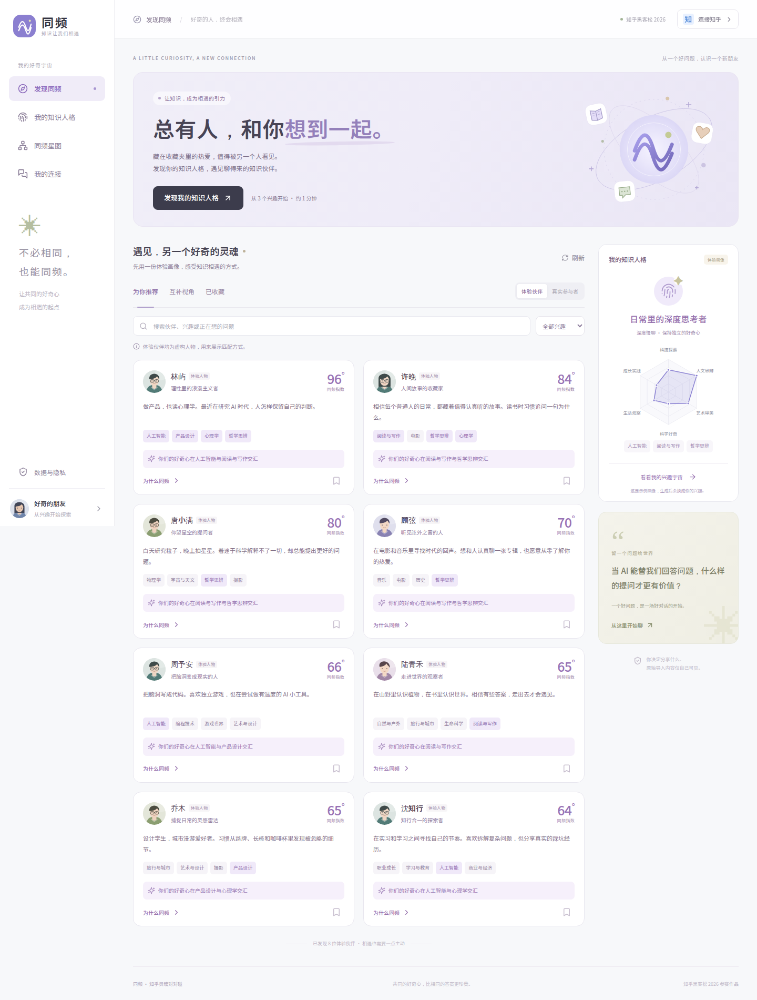

# 同频 · 知乎灵魂对对碰

**总有人，和你想到一起。** 从共同的好奇心出发，生成有依据的知识兴趣画像，发现可以认真交流的伙伴。

知乎黑客松 2026「灵魂匹配局」参赛作品，对应方案二。

- 在线体验：**https://zhihupipei.aiimage.icu**
- 产品说明：[docs/PRODUCT.md](docs/PRODUCT.md)
- 演示流程：[DEMO.md](DEMO.md)
- 接口与验证：[API](docs/API.md) · [验证记录](docs/VALIDATION.md)



## 完整体验

| 页面 | 已实现功能 |
| --- | --- |
| 发现同频 | 关键词与兴趣筛选、同频/互补推荐、真实匹配池、收藏、匹配详情 |
| 我的知识人格 | 三步创建、AI 兴趣分析、六维雷达、原始依据、偏好编辑、PNG 人格卡 |
| 同频星图 | 可拖动、筛选、缩放的兴趣关系图，点击伙伴查看匹配 |
| 我的连接 | 收藏、邀请、接受/婉拒、SSE 实时双人聊天、历史分页与草稿保护 |
| 数据与隐私 | 主动参与/退出匹配、导出本人资料、清除知乎导入、屏蔽与恢复、删除账号数据 |

体验池中的八位人物均为明确标注的虚构角色，不能接收邀请。真实池只展示主动加入的参与者，初始为空。两个浏览器分别生成画像并加入匹配，即可完成真实的邀请与对话。

画像描述知识兴趣和交流偏好，不是心理测评。匹配指数的四项权重可以逐项核对，不代表关系成功概率。星图的连线表示共同兴趣，不表示伙伴之间已经认识。

## 本地启动

需要 **Node.js 22.13 或更新版本**。

```bash
npm ci
cp .env.example .env.local
npm run dev
```

开发页面 `http://127.0.0.1:5176`，后端 `http://127.0.0.1:3022`。不配置模型和知乎凭证，也能使用完整的兴趣填写、规则分析、匹配与双方同意后的对话。

生产模式：

```bash
npm run build
npm start
```

前后端统一由 `http://127.0.0.1:3022` 提供。SQLite 自动创建在 `data/`，私有配置、运行数据、依赖和构建文件均已加入 `.gitignore`。

## 模型配置

在服务端 `.env.local` 填写自己的兼容接口：

```dotenv
SOUL_USE_LOCAL_MODEL=false
SOUL_AI_PROTOCOL=openai
SOUL_AI_BASE_URL=https://your-provider.example/v1
SOUL_AI_API_KEY=your-private-key
SOUL_AI_MODEL=your-model
SOUL_AI_JSON_MODE=true
```

当前部署已用用户指定服务中的 `deepseek-v4-flash` 验证画像、解释、破冰三条实际调用链，使用 `SOUL_AI_DISABLE_THINKING=true`。其他供应商按其支持情况设置该选项。密钥只在后端读取，不进入前端、仓库、日志或 API 响应。

文本模型输出经过 JSON、字段、证据与引用校验。超时、格式异常或限流时，页面明确显示规则分析及原因。外部模型调用共用每分钟 5 次、同时 2 个请求的上限，并做短期缓存与并发去重。

可选 `SOUL_EMBEDDING_MODEL` 支持语义向量匹配；目前线上使用知识主题向量，**没有把主题计算标成真实 embedding**。

## 知乎能力

已按官方协议实现知乎登录与选择性导入：公开创作标题/摘要、关注用户简介、近期收藏摘要，每类最多 10 项。读取授权用户数据时同时使用应用 Access Secret 与用户 OAuth Token。基础身份接口独立使用用户 Token，大整数用户 ID 无损解析。

当前还需要本作品的赛事凭证完成官方授权联调：

```dotenv
ZHIHU_OAUTH_APP_ID=
ZHIHU_OAUTH_APP_KEY=
ZHIHU_OAUTH_REDIRECT_URI=https://zhihupipei.aiimage.icu/api/auth/zhihu/callback
ZHIHU_ACCESS_SECRET=
```

回调需与赛事登记完全一致，且平台必须可靠回传 `state`；缺失或不匹配时服务拒绝建立登录。未配置时，产品明确提供手动兴趣入口，不声称读取过知乎数据。当前官方能力不包含点赞或浏览历史。

OAuth Token 仅保存在服务端内存，服务重启后需重新连接知乎。访客身份关联当前浏览器 Cookie，退出后无法找回访客资料，界面会在退出前提示。撤回发现会取消待处理邀请；已接受连接继续保留，屏蔽或删除可结束连接访问。

## 验证

```bash
npm test
npm run build
npx playwright install chromium
npm run test:browser
```

已有浏览器时可设置 `CHROMIUM_PATH=/absolute/path/to/chromium`。浏览器套件自动启动独立服务和临时 SQLite，使用规则模型，不消耗真实模型额度，也不写入正式用户库。

- 39 项后端测试：身份与权限、可解释匹配、隐私边界、OAuth、模型与向量异常、消息幂等与持久化。
- 42 项浏览器检查通过：覆盖首页与星图、三步画像、文件导出、双用户邀请聊天，以及 390px/320px 手机流程。
- 公网 HTTPS 8 项检查通过，页面实际完成画像、解释、破冰三次模型调用；临时验收账号已删除。见 [公网验证报告](artifacts/public-validation.json)。
- 报告和实际截图保存在 [artifacts/](artifacts/)，总入口为 `artifacts/browser-suite.json`。

## 技术与部署

React 19 + TypeScript + Vite，原生 CSS，D3 Force + SVG 图谱；Express 5 + Node.js SQLite + SSE。单机参赛部署直接使用 SQLite，便于完整复现和持久化。模型适配支持 OpenAI 兼容接口与 Anthropic Messages 协议。

```text
src/              页面、弹窗、图谱、响应式样式
shared/catalog.js 兴趣目录、六维知识坐标、交流偏好
server/           身份、画像、匹配、模型、知乎、邀请和聊天
tests/            后端与协议测试
scripts/          隔离浏览器验收及上线验收
deploy/           systemd 与 Caddy 配置
docs/             产品说明、API、验证与部署文档
```

当前域名通过 Caddy 自动 HTTPS 代理到本机 3022，`soulmatch.service` 负责开机启动与异常恢复。[部署与维护说明](docs/DEPLOYMENT.md)。

所有人物头像和主视觉均为项目内 SVG 绘制；中文字体为本地 Noto Sans SC 子集，字体许可证见 [public/fonts/OFL.txt](public/fonts/OFL.txt)。
