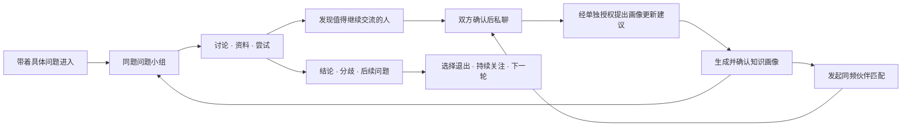

# 同题 × 同频合并与优化方案

日期：2026-09-13。本文件保留最初的产品合并设计；同知 2.0.0 现已实施并部署，逐项实际范围见 [RELEASE.md](RELEASE.md)，测试证据见 [VALIDATION.md](VALIDATION.md)。文中尚未实现的扩展与效果指标仍属后续建议。

用户已指定新项目入口：**https://zhihu.aiimage.icu**。该域名现已切换到正式合并版。

## 1. 产品决策

建议新项目暂名「同知」，保留两个清楚的功能入口：**同题，把一个问题讨论清楚；同频，认识自己并找到能深入交流的人。**

核心对象是问题、知识画像和有来源的成果。首页以「你最近想弄清楚什么？」为主要入口，同时提供「先认识我的知识兴趣」。用户可以带着具体问题直接加入小组，也可以从自己的知识报告进入推荐问题和伙伴。

完整路径：

衡量价值的主要问题是「用户有没有更清楚地理解原问题」，并辅以「知识画像是否准确、有帮助」「伙伴交流是否有收获」。不以消息数量、在线等待人数或群聊时长作为核心成功指标。

## 2. 从现有代码出发

| 能力 | 当前事实 | 合并动作 |
| --- | --- | --- |
| 同题讨论 | 已有真实加入、成员权限、回复、SSE、进展、订阅和退出 | 迁移业务能力，围绕问题目标重组页面 |
| 同题成果 | 已有 AI 开场、梳理、成果草稿、引用校验、版本编辑和 Markdown 导出 | 扩展为阶段成果和结论核对流程 |
| 同题资料 | 已接通知乎搜索，区分原始链接、成员摘录和搜索摘要 | 统一为两类交流共用的知识来源模块 |
| 同题账号 | 有邮箱密码、访客、管理后台；邮箱归属未验证 | 接入统一账号，不能靠同名或相同邮箱自动合并 |
| 同频画像 | 有自填兴趣、经授权的知乎摘要、六维分析、证据、分享卡 | 扩展可解释的知识报告和历史版本 |
| 同频知乎接入 | 登录及五项 OAuth 用户数据接口已有真实验收 | 作为统一知乎接入基线；新部署仍需对应回调验收 |
| 同频连接 | 已有邀请、双方确认、屏蔽、持久私聊及破冰建议 | 复用权限与聊天能力，支持从问题小组发起连接 |
| 同频在线配对 | 使用内存队列，依赖心跳；离线约 45 秒移出 | 新建持久异步匹配，不能只延长旧队列超时 |
| 双方技术栈 | React 19、Express 5、Node SQLite、SSE | 一个应用和统一数据层；以同频 TypeScript 前端为基础 |

代码与迁移细节见 [实施方案](IMPLEMENTATION_PLAN.md)。本次规划未重新调用知乎业务接口、模型或生产用户数据。

## 3. 用户能直接感受到的页面变化

建议主导航为「发现问题」「我的同题」「同频伙伴」「知识画像」「消息」。成果归在对应问题和个人成果收藏中，管理后台保持独立入口。

| 页面 | 核心内容 | 主要动作 |
| --- | --- | --- |
| 发现问题 | 具体问题、适合谁、当前阶段、预期收获、推荐原因 | 输入问题或知乎链接，选择小组 |
| 问题小组 | 问题边界、本轮目标、未解子问题、阶段状态 | 加入、贡献经验或资料、核对结论 |
| 小组讨论 | 按子问题组织的讨论，保留轻量消息交流 | 回复观点、引用资料、标记需要验证 |
| 阶段成果 | 已有结论、适用条件、主要分歧、待验证事项、来源 | 核对、补充、保存或开启下一轮 |
| 知识画像 | 兴趣结构、证据覆盖、关注方向、交流偏好和建议 | 修正画像、控制公开范围、导出分享卡 |
| 同频伙伴 | 匹配意图、候选原因、可深入的问题、共同或互补知识 | 发起匹配、查看提案、同意或婉拒 |
| 消息 | 小组更新、匹配结果、双方确认后的私聊 | 按自己的节奏处理，管理提醒 |

小组页顶部始终能看见本轮问题和目标；桌面显示讨论与阶段进度，手机用「讨论 / 资料 / 成果」切换。移除以头像墙、灵魂分数、在线倒计时为主要视觉中心的设计。原有星图可降为知识画像中的探索视图，首版合并不为它增加开发范围。

## 4. 同题：问题、成员和讨论轮次

### 4.1 每个小组要回答什么

创建或加入时围绕四个字段组织：**具体问题、我的处境、这轮想得到什么、目前了解多少**。用户可跳过非必要自述；匹配理由优先使用他们主动选择的目标和阶段。

例如，将「AI 学习交流群」具体化为「零基础产品经理，如何用两周完成第一个 RAG 原型？」；将「读书群」具体化为「读完《乡土中国》后，如何理解今天的熟人社会？」。资料和发言可以标为经验、证据、假设、提问或尝试反馈，不强制每条消息填写表单。

一个知乎问题可以对应不同目标或知识阶段的小组。首版优先推荐已有合适小组，创建时提示重复；开放问题不要求只有一个标准答案。小组规模可先按 6–12 人设计，人数只是试运行参数，不用虚拟用户凑数。

### 4.2 两条独立的生命周期

**小组轮次：** 招募 → 讨论 → 待核对成果 → 阶段完成 → 归档，或启动下一轮。长时间无人讨论进入休眠，不自动宣称问题已解决。完成意味着本轮目标得到整理，成果可以明确写「目前尚无结论」。

**个人参与：** 临时参与（建议可选 24 小时或 7 天）／持续参与，随时退出。到期停止新增提醒和成员权限，保留本人可导出的参与记录；用户主动续期才继续参与。退出、到期与删除本人内容是不同操作。深入用户可继续下一轮，已完成的成果保持版本记录。

第一版「公共讨论」指已加入小组的成员共同讨论。完整发言、成员细节及组内成果沿用现有成员可见权限；向互联网公开成果需要单独确认可发布范围，不能把旧讨论自动公开。

### 4.3 AI 主持要有工作边界

保留手动「梳理一下」「提出下一问」「整理阶段成果」，增加可关闭的低频自动主持：

- 新成员进入时展示已有进展摘要，不为每次加入刷一条欢迎消息。
- 自动总结建议在本轮新增至少 20 条真人发言且距离上次至少 30 分钟后才具备触发条件；没有新信息时不生成。
- 卡住时提出一个能推进目标的子问题，或邀请成员补充反例、证据和实践结果。
- 阶段到期或主持人发起收尾时生成成果草稿，等待成员核对；显示核对人和保留分歧，不把一人的确认标成全员共识。
- 潜水提醒默认关闭。成员主动允许后，最多每周一次私密提醒；不公开点名，不按发言次数给人贴标签。

成果固定包含：问题与范围、核心结论及适用条件、支持证据、主要争议、待验证事项、推荐资料和下一步。保留真人发言及资料引用，AI 推测单独标明。已隐藏或当前用户无权读取的内容，不能经总结、画像或导出再次泄露。

## 5. 同频：先让画像本身有价值

知识报告建议包含以下内容，每条判断都带来源、生成时间、证据覆盖和用户修正入口：

| 内容 | 表达方式及限制 |
| --- | --- |
| 主要兴趣 | 用户主动选择与授权内容支持的领域，区分长期自述和近期样本 |
| 知识结构 | 领域之间的联系、实践与理论关注比例，避免把兴趣权重等同于能力分数 |
| 关注方向 | 当前反复出现的问题；有足够跨时间样本后才展示变化趋势 |
| 探索倾向 | 是否主动跨领域、喜欢追问原理或尝试实践，允许用户否认 |
| 擅长领域 | 优先由用户自述并选择证据；有限摘要不能证明专业资质 |
| 思考与交流偏好 | 证据、反例、讨论节奏、实践目标等，以用户确认的偏好为主 |
| 知识盲区与下一步 | 提供探索建议和可追溯资料，不把未知当成能力缺陷 |
| 分享版知识卡 | 默认只显示用户选择的兴趣与说明，发布前预览，不含原始导入资料 |

底层区分「用户自述」「材料支持的观察」「待确认的推测」。样本少时明确说明覆盖有限。知识深度使用用户选择的学习阶段及作品证据作讨论适配，不生成智力、人格诊断或敏感身份推断。

正式知识画像不因后台模型输出自动改写。新增建议先供用户接受、编辑或删除；每次发布产生新版本，重新计算相关匹配并清理旧授权下的缓存。

## 6. 异步匹配：用户点击开始后可以离开

保留「点击开始」这一主动动作，主文案调整为「帮我找知识伙伴」。发起时选择想聊的问题、同频或互补、当前阶段、交流节奏；参与后台匹配与公开出现在发现页是两个独立选项。

建议首版规则：

1. 一人一个有效匹配请求，默认有效 7 天，可暂停、取消或主动续期。
2. 候选只来自明确开启接收匹配的真实账号；关闭浏览器不退出，账号停用、屏蔽、撤回同意及请求到期会退出。
3. 后台在新请求、画像确认更新和定期检查时计算；基础匹配不依赖实时模型调用或持续读取知乎。
4. 先过滤目标、权限、屏蔽和阶段限制，再按问题相关性、领域交集或互补、讨论深度及节奏排序。展示 2–3 条具体理由，不把综合分数描述成关系成功概率。
5. 一次给双方一个待确认提案，建议有效 48 小时；双方分别确认后创建私聊。任一方取消、拒绝或失效时释放提案，另一个仍有效的请求继续寻找，避免反复推荐刚拒绝的人。
6. 结果保存在站内通知箱；在线时即时更新，离线时下次打开可见。浏览器关闭后的系统推送需单独实现 Web Push 并获得通知权限，不能把 SSE 说成离线推送。首版不依赖邮件或知乎站内信。

同题内的「就这个问题继续聊」使用同一套连接机制：展示本问题中的公开贡献及用户允许展示的知识卡，发起者明确发送邀请，接收者同意后建立关系。不要求开启全站发现，也不把群内成员列表当作可批量联系的名单。

社群推荐与伙伴匹配共用知识标签和证据结构，但分别排序。推荐社群更关注具体问题、用户当前阶段、本轮目标、是否允许新成员进入及小组容量，不以人数最多为首选；也保留用户自主搜索不同观点与领域的入口。

## 7. AI 破冰、知识伙伴与自我对话

双方建立连接后，自动准备三类可编辑话题：**共同问题的关键分歧、彼此经验能互补的细节、可以一起尝试的小任务。** 默认展示已有本地建议；满足 AI 使用范围后后台生成更具体的建议，只更新话题卡，不替用户发言。

例如，围绕共同关注的 RAG：从「你也喜欢 AI 吗」推进到「在你们各自的场景里，回答不可靠主要来自检索不到资料还是模型误用资料？怎样设计一次能区分两者的小实验？」。例子是设计示意，不冒充读取过真实用户回答。

话题可关联实际取得的知乎搜索摘要、用户明确分享到本次对话的原文链接和小组中双方都有权读取的资料。保留标题、作者、链接和摘要类型；无有效来源时允许不附引用。双方确认聊天不等于授权互看私有导入材料。

真人暂无合适候选时保留真实等待状态，同时提供独立选项「和 AI 知识伙伴探讨」「与自己的知识画像对话」。AI 始终明确标识，不进入真人数量、候选池或匹配成功统计。先做一个可配置领域的知识伙伴，再考虑多个角色；自我对话用于分析兴趣结构、澄清目标和提出反思问题，不模拟对用户作心理诊断。

## 8. 匿名、治理与个人数据

默认使用站内昵称和生成头像。知乎昵称、原头像、账号链接、邮箱和原始摘要不默认展示给群友或候选人。双方确认后仍可保持匿名，具体资料分享由用户自己选择。首版交流支持文本、经过校验的知识来源卡；暂不开放聊天照片和任意附件上传。

治理采用多层机制：发送与邀请频率限制、重复纠缠等行为信号、基础内容规则、AI 上下文审核、举报和人工复核。AI 审核优先覆盖私聊邀请、新连接初期、高风险信号和举报，不宣称每条消息都经过模型审核。需审核的高风险内容等待结果再投递；模型超时或额度不足时保持待处理或人工复核，不悄悄放行。

根据证据执行提醒、拒绝投递、临时禁言或限制邀请；永久封禁和争议申诉进入管理员复核。AI 不能仅凭知识观点不同作处罚。记录必要的规则版本、处理原因和复核记录，审核资料限权可见；运营统计页面不提供任意浏览私聊的入口。

授权分开管理：知乎数据导入、外部 AI 分析、参与人物匹配、接收组内连接、画像可见范围、聊天改善画像、系统通知。加入小组前说明该组的 AI 主持及内容处理规则。

「聊天改善画像」默认关闭。开启后首版仅从本人主动选中的发言生成待确认建议，排除引用的他人内容；使用完整双人对话需要双方分别同意，使用群聊上下文则需覆盖所有被纳入发言者的授权。授权不是模型训练许可，不以使用产品为条件强制开放聊天数据。

撤回授权后取消相关后台任务，清除待确认建议、派生索引及缓存；删除来源后依赖它的画像判断和摘要失效或重建。匹配和小组查询在读取时检查最新权限，缓存不能绕过撤回或屏蔽。个人导出、清除导入、删除账号和治理申诉作为同一个数据与隐私入口提供。

## 9. 知乎接入的可实施边界

- 首版实现粘贴知乎问题链接、站内知乎问题卡进入小组，以及独立的小组邀请链接。解析规范问题标识并保留来源，任何链接都不自动加入。
- 在知乎网站问题页显示「加入同题」需要用户安装浏览器扩展或取得平台入口支持。它列为后续工作，不把普通 OAuth 登录或开放 API 当成可以修改知乎页面的能力。
- 授权用户数据沿用官方支持的创作标题与摘要、关注、收藏接口。不能将开发者本人全文接口用于代读全部登录用户的回答；需要正文时依赖合法可用接口或用户主动提供的内容，注明来源。
- 不假设能获取点赞、浏览历史、某个问题的全部关注者或对这些人自动发私信。用户少、素材少和匹配暂时没有结果均如实显示。
- 新部署使用准确登记的 OAuth 回调和自己的应用会话；原项目验收不替代新域名的实际授权验收。

## 10. 16 项方向逐项落实

| 原需求 | 产品落点 | 实施阶段 |
| --- | --- | --- |
| 1 问题驱动、一键加入 | 问题入口与目标、小组推荐；原站按钮列扩展能力 | P1；扩展 P3 |
| 2 生命周期 | 临时与持续参与、轮次、休眠、归档和退出 | P1 |
| 3 用户分层 | 小组成员讨论 → 自愿建立连接 → 深入协作 | P1 |
| 4 克制的 AI 主持 | 按需整理与有条件的低频自动主持、提醒开关 | P1；精细策略 P2 |
| 5 以解决问题为成果 | 可核对的结论、分歧、来源、下一步及阶段完成 | P1 |
| 6 同题打通同频 | 从问题贡献发起连接、按画像推荐小组 | P1 |
| 7 知识人格差异化 | 有依据的知识报告、阶段与偏好、不做心理诊断 | P1 |
| 8 自我认知 | 可解释分析、修正与分享；长期趋势积累样本后展示 | P1；趋势 P2 |
| 9 无需同时在线 | 持久请求、后台提案、双方确认、站内通知 | P1 |
| 10 真正的 AI 破冰 | 基于问题、经验差异和下一步行动生成话题 | P1 |
| 11 关联知乎知识 | 有来源的资料卡、明确摘要范围和引用权限 | P1 |
| 12 AI 伙伴与自己对话 | 独立 AI 入口，明确身份，保留真人匹配请求 | P2 |
| 13 匿名与安全 | 昵称、独立公开范围、双确认、文本优先、屏蔽 | P0–P1 |
| 14 AI 治理 | 基础规则和行为信号、重点语义审核、复核申诉 | P1；策略优化 P2 |
| 15 授权聊天完善画像 | 单独同意、本人选定内容、待确认更新、可撤回 | P2 |
| 16 匹配同频社群 | 从知识画像和当前问题推荐适合的讨论轮次 | P1 |

P0 为合并基础，P1 为首个完整演示版本，P2 为完善知识体验，P3 为依赖外部入口或规模的扩展；具体工作及验收见实施方案。

## 11. 第一版演示与成功标准

三分钟演示建议用一个贯穿问题：用户 A 确认知识画像，进入推荐问题小组，与用户 B 围绕资料进行讨论；生成带来源和争议点的成果；A 从 B 的贡献发出深入交流邀请，B 同意后看到针对本问题的破冰话题。另展示 A 发起后台匹配并关闭页面，结果保留在通知箱，回到应用后可处理。

真人试用优先记录：达到本轮目标或说明尚未解决的比例、用户对画像的准确性评价、画像修正率、匹配提案接受率、双方交流后的有用性反馈、从小组进入自愿深聊的比例，以及举报、误判和退出后仍被通知的次数。试用建议 5–10 位真实用户；目标值根据首轮结果确定，不事先宣称效果提升。

首版完成判断：用户能够用同一账号走完「问题 → 小组 → 有来源的成果 → 双向知识连接」，画像本身可独立查看、修正和分享，异步匹配可跨重启恢复，隐私撤回与屏蔽覆盖所有入口。
